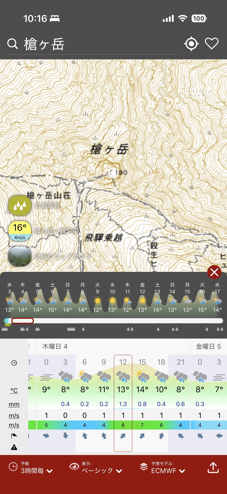

# Windy GSI Pale Topo Map Plugin

A [Windy.com](https://www.windy.com) plugin that overlays Japan's **国土地理院 (GSI) 淡色地図** (pale topographic map) at high zoom levels, replacing the default outdoor map with accurate Japanese terrain data.



## Features

- Shows the GSI pale topo map at **zoom ≥ 10**, covering the default outdoor map
- At zoom < 10, Windy's default view is shown unchanged so weather overlays work normally
- Adjustable opacity from the plugin panel
- Layer persists while navigating — clicking map points or switching views won't hide it
- Works on both **desktop and mobile**

## Tile source

Tiles are served from the [Geospatial Information Authority of Japan (国土地理院)](https://maps.gsi.go.jp/development/ichiran.html) under their standard usage terms. No API key required.

```
https://cyberjapandata.gsi.go.jp/xyz/pale/{z}/{x}/{y}.png
```

## Install

Load the plugin in [Windy developer mode](https://www.windy.com/developer-mode):

```
https://windy-plugins.com/5026988/windy-plugin-gsi-bvmap/0.1.0/plugin.min.js
```

Then navigate to `https://www.windy.com/gsi-bvmap` to open the plugin panel.

## Development

**Prerequisites:** Node.js 18+

```bash
git clone https://github.com/kakugirai/windy-bvmap-plugin
cd windy-bvmap-plugin
npm install
npm start        # starts dev server at https://localhost:9999/plugin.js
```

Load `https://localhost:9999/plugin.js` in Windy developer mode. Accept the self-signed certificate first by visiting that URL directly in your browser.

**Build for production:**

```bash
npm run build    # outputs to dist/
```

## Publishing

The GitHub Actions workflow `.github/workflows/publish-plugin.yml` handles publishing to `windy-plugins.com`. To publish a new version:

1. Bump the version in both `package.json` and `src/pluginConfig.ts`
2. Commit and push
3. Go to **Actions → publish-plugin → Run workflow**

Requires a `WINDY_API_KEY` repository secret from [api.windy.com/keys](https://api.windy.com/keys).

## Todo

- [ ] **Vector tile support** — GSI provides the same map as optimized vector tiles in both PBF (`/xyz/optimal_bvmap-v1/{z}/{x}/{y}.pbf`) and PMTiles (`optimal_bvmap-v1.pmtiles`) formats, which would give sharper rendering at all zoom levels. However, Windy's LeafletGL is a stripped-down fork of MapLibre GL JS that does not support `type: "vector"` sources added externally. May investigate a workaround or alternative approach in the future.

## Attribution

Map data © [国土地理院](https://www.gsi.go.jp/)

## License

MIT
